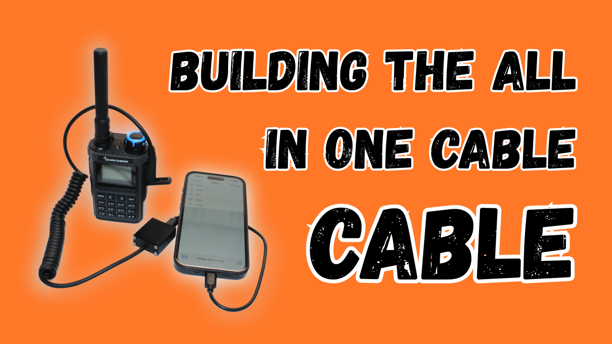

# All-In-One-Cable Cable

An enclosure for attaching a K-type / "Kenwood" microphone cable to the AIOC.

[Build video](https://youtu.be/iKqke8ZRxv0)

## Bill of Materials

- **M2 Brass Heat-Set Inserts**:
  - Affiliate link: https://s.click.aliexpress.com/e/_c4bliVCF
  - Non-affiliate link: https://www.aliexpress.com/item/1005007342105110.html
- **M2 x 6 mm Pan Head Screws**
  - Affiliate link: https://s.click.aliexpress.com/e/_c4cd5Sq7
  - Non-affiliate link: https://www.aliexpress.com/item/1005008709978631.html
- **Baofeng Speaker Micicrophone**:
  - Affiliate link: https://s.click.aliexpress.com/e/_c372xDzN
  - Non-affiliate link: https://www.aliexpress.com/item/1005007494900252.html

## 3D Printed Parts

### FreeCAD Design

- [all-in-one-cable-cable-enclosure.fcstd](<all-in-one-cable-cable-enclosure.fcstd>)

### All-In-One-Cable Cable Box

- [all-in-one-cable-cable-enclosure-box.stl](<all-in-one-cable-cable-enclosure-box.stl>)

### All-In-One-Cable Cable Lid

- [all-in-one-cable-cable-enclosure-lid.stl](<all-in-one-cable-cable-enclosure-lid.stl>)
